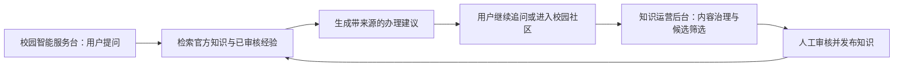

# 校园智能服务台产品说明

## 产品定义

“数智校答”是面向高校师生的校园事项服务产品，由两个协同工作空间组成：

1. **校园智能服务台**：帮助师生查询规则、确认材料、理解流程并找到下一步办理入口。
2. **知识运营后台**：帮助运营人员审核内容、沉淀经验、维护检索运行状态，并持续提高答案可信度。

产品不是通用聊天机器人。它聚焦教务、考试、奖助和生活服务等高频校园事项，回答必须尽量做到“有结论、有步骤、有来源、有边界”。

## 核心用户与任务

| 用户 | 核心任务 | 产品结果 |
| --- | --- | --- |
| 学生、教师 | 快速确认事项规则、时间、材料和入口 | 在 3 分钟内知道下一步怎么做 |
| 知识运营员 | 发现高价值经验、审核知识、处理内容风险 | 把分散内容变成可追溯知识 |
| 系统管理员 | 维护账号、检索服务与发布质量 | 确保服务安全、稳定、可回退 |

## 双端闭环

## 当前范围

### 校园智能服务台

- 自然语言问答与流式回复
- 官方来源和社区经验分层展示
- 游客免登录试问一次，登录后继续追问
- 普通浏览器可在 24 小时内恢复未完成问题；无痕窗口关闭后不跨会话追踪
- 数字人和语音讲解作为可选表达层
- 校园社区内容查看、发布与回复

### 知识运营后台

- 社区帖子与回复审核
- 高价值内容候选池
- 社区知识生成、审核和发布
- LightRAG 服务状态与文档处理状态查看
- 管理员会话和服务端权限保护

## 信任规则

- 官方资料优先；社区经验只作补充并明确标识。
- 来源不足时明确说无法确认，不生成伪确定答案。
- 社区知识必须人工审核后才参与问答。
- 所有管理写操作必须经过服务端管理员鉴权。
- 生产密钥、验证码和个人敏感信息不得进入仓库或日志。
- 游客 Cookie 用于体验额度；服务端按网络设置宽松防刷上限，不使用浏览器指纹追踪无痕用户。

## 本阶段不做

- 泛娱乐聊天、复杂多智能体编排或模型微调
- 私信、推荐流和多级社交关系
- 在 Web 试运营质量未达标前扩展更多终端
- 用数字人效果替代答案正确性与服务闭环

## 核心衡量指标

北极星指标是“可信问题解决率”：回答有有效来源，并且用户确认已解决或有帮助的会话占比。

试运营发布门槛：

- Top 50 高频问题首条检索准确率不低于 85%
- 有正式来源的回答占比不低于 90%
- 管理端未授权写操作成功数为 0
- 无结果和低置信问题全部进入待补齐池
- 试运营用户“有帮助”反馈率不低于 70%
